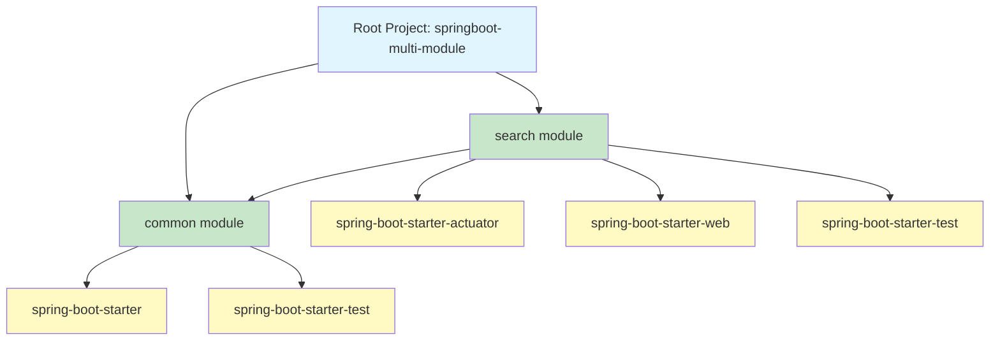

# Dependency Graph

## 📁 Repository Structure

This repository contains multiple projects. Each project has its own dependency documentation:

### Spring Boot Multi-Module Project
- **Location**: `springboot_multi_module/`
- **Detailed Documentation**: [springboot_multi_module/DEPENDENCY_GRAPH.md](./springboot_multi_module/DEPENDENCY_GRAPH.md)
- **Quick Start**: Run `cd springboot_multi_module && ./generate-dependency-graph.sh`

---

## Project Overview
This is a Spring Boot multi-module Gradle project consisting of two modules:
- **common**: A library module with shared business logic
- **search**: A web application module that provides REST APIs

## Module Dependency Graph



## Module Dependencies

### Root Project
- **Group**: com
- **Version**: 1.0-SNAPSHOT
- **Java Version**: 21
- **Build Tool**: Gradle

### Common Module
**Purpose**: Shared library module containing business entities and services

**Dependencies**:
- `org.springframework.boot:spring-boot-starter` (implementation)
- `org.springframework.boot:spring-boot-starter-test` (test)
- Spring Boot version: 2.7.18

**Exports**:
- `com.common.Product` - Product entity class
- `com.common.ProductService` - Product service with CRUD operations

**Artifact**: 
- Base Name: `springboot-multi-module-library`
- Version: `0.0.1-SNAPSHOT`

### Search Module
**Purpose**: Web application module providing REST APIs for product search and management

**Dependencies**:
- `org.springframework.boot:spring-boot-starter-actuator` (implementation)
- `org.springframework.boot:spring-boot-starter-web` (implementation)
- `project(':common')` (implementation) - Internal module dependency
- `org.springframework.boot:spring-boot-starter-test` (test)
- Spring Boot version: 2.7.18

**Imports from Common Module**:
- `com.common.Product`
- `com.common.ProductService`

**Artifact**:
- Base Name: `springboot-multi-module-search`
- Version: `0.0.1-SNAPSHOT`

**Main Application**: `com.search.SearchApplication`

## External Library Dependencies

### Spring Boot 2.7.18
The project uses Spring Boot version 2.7.18 with the following starters:

#### spring-boot-starter
Basic Spring Boot starter with core dependencies:
- Spring Core
- Spring Boot
- Spring Boot Autoconfigure
- Logging (Logback)

#### spring-boot-starter-web
Web application support including:
- Spring MVC
- Embedded Tomcat server
- Jackson for JSON processing
- REST API support

#### spring-boot-starter-actuator
Production-ready features:
- Health checks
- Metrics
- Application monitoring endpoints

#### spring-boot-starter-test
Testing support including:
- JUnit
- Spring Test
- Mockito
- AssertJ
- Hamcrest

### Test Dependencies
- JUnit 4.12 (root project)

## Dependency Tree

To view the complete dependency tree for each module, use the following Gradle commands:

```bash
# View dependencies for all modules
./gradlew dependencies

# View dependencies for common module
./gradlew :common:dependencies

# View dependencies for search module
./gradlew :search:dependencies

# Generate HTML dependency report
./gradlew htmlDependencyReport
```

## Transitive Dependencies

### Common Module Transitive Dependencies
Through `spring-boot-starter`:
- spring-core
- spring-context
- spring-beans
- spring-aop
- spring-expression
- logback-classic
- slf4j-api

### Search Module Transitive Dependencies
Through `spring-boot-starter-web`:
- All spring-boot-starter dependencies
- spring-web
- spring-webmvc
- tomcat-embed-core
- tomcat-embed-el
- tomcat-embed-websocket
- jackson-databind
- jackson-core
- jackson-annotations

Through `spring-boot-starter-actuator`:
- micrometer-core
- spring-boot-actuator
- spring-boot-actuator-autoconfigure

## Dependency Management

The project uses Spring Boot's dependency management plugin to manage versions:
- Common module: Uses `io.spring.dependency-management` plugin
- Search module: Uses `org.springframework.boot` plugin with dependency management

This ensures consistent versions across all Spring Boot dependencies without explicitly specifying versions.

## Build Order

When building the project, Gradle automatically determines the correct build order:
1. **common** module is built first (no internal dependencies)
2. **search** module is built second (depends on common)

Build command: `./gradlew build`

## Running the Application

The search module is the runnable application:
```bash
# Build all modules
./gradlew build

# Run the search application
./gradlew :search:bootRun
```

The application runs on port 8100 (configured in search module's application.properties).

## Dependency Graph Generation

### Quick Start - Automated Script

For the easiest way to generate all dependency reports, use the provided script:

```bash
cd springboot_multi_module
./generate-dependency-graph.sh
```

This script will:
1. Generate project structure overview
2. Display dependency trees for each module
3. Create comprehensive dependency reports
4. Generate an HTML report viewable in your browser

### Manual Commands

To generate detailed dependency reports, use the Gradle tasks defined in the root `build.gradle`:

```bash
# Navigate to the project directory
cd springboot_multi_module

# Generate dependency report for all modules
./gradlew generateDependencyGraph

# Print project structure and module dependencies
./gradlew printProjectStructure

# Generate HTML report (opens in browser)
./gradlew htmlDependencyReport
# View at: build/reports/project/dependencies/index.html

# View dependencies for specific modules
./gradlew :common:dependencies
./gradlew :search:dependencies
```

### Available Gradle Tasks

Custom tasks added for dependency analysis:

| Task | Description |
|------|-------------|
| `printProjectStructure` | Displays module hierarchy and dependencies in console |
| `generateDependencyGraph` | Generates comprehensive dependency reports for all modules |
| `htmlDependencyReport` | Creates browseable HTML report with full dependency tree |

---

## Tools and Artifacts Created

This dependency graph implementation includes:

1. **📄 Documentation Files**:
   - `DEPENDENCY_GRAPH.md` (root) - High-level overview
   - `springboot_multi_module/DEPENDENCY_GRAPH.md` - Detailed dependency documentation with Mermaid diagrams

2. **🔧 Gradle Tasks**:
   - `printProjectStructure` - Console output of project structure
   - `generateDependencyGraph` - Comprehensive dependency report generation

3. **📜 Automation Script**:
   - `generate-dependency-graph.sh` - One-command dependency graph generation

4. **📊 Visual Diagrams**:
   - Mermaid diagrams showing module relationships
   - Class-level dependency diagrams
   - Complete dependency trees

5. **📈 Reports**:
   - HTML dependency reports (generated on demand)
   - Console-based dependency trees
   - Module structure overview

---

## Usage Examples

### View Project Structure
```bash
cd springboot_multi_module
./gradlew printProjectStructure
```

Output:
```
PROJECT STRUCTURE: springboot-multi-module
Root Project: springboot-multi-module
  Group: com
  Version: 1.0-SNAPSHOT
  
  Module: common
    Dependencies:
      - [External] org.springframework.boot:spring-boot-starter
      
  Module: search
    Dependencies:
      - [External] org.springframework.boot:spring-boot-starter-actuator
      - [External] org.springframework.boot:spring-boot-starter-web
      - [Module] common
```

### Generate All Reports
```bash
cd springboot_multi_module
./generate-dependency-graph.sh
```

### View HTML Report
```bash
cd springboot_multi_module
./gradlew htmlDependencyReport
# Then open: build/reports/project/dependencies/index.html
```
