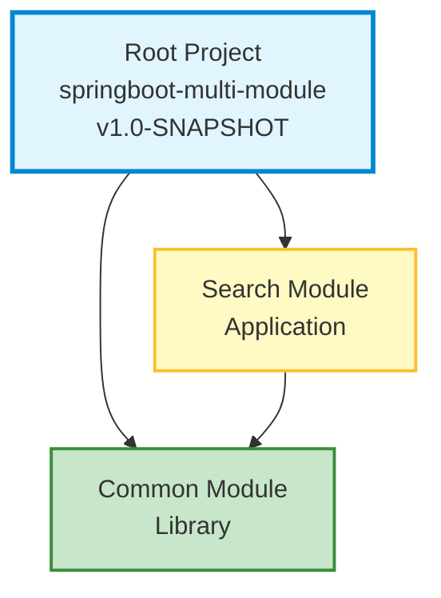
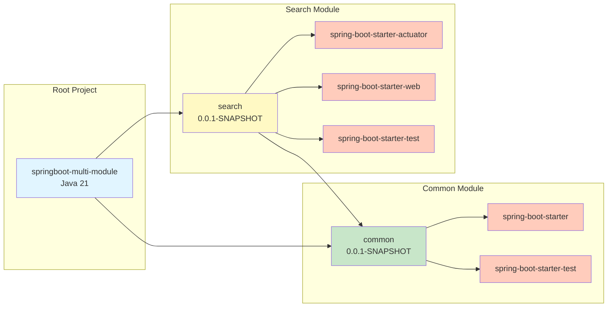
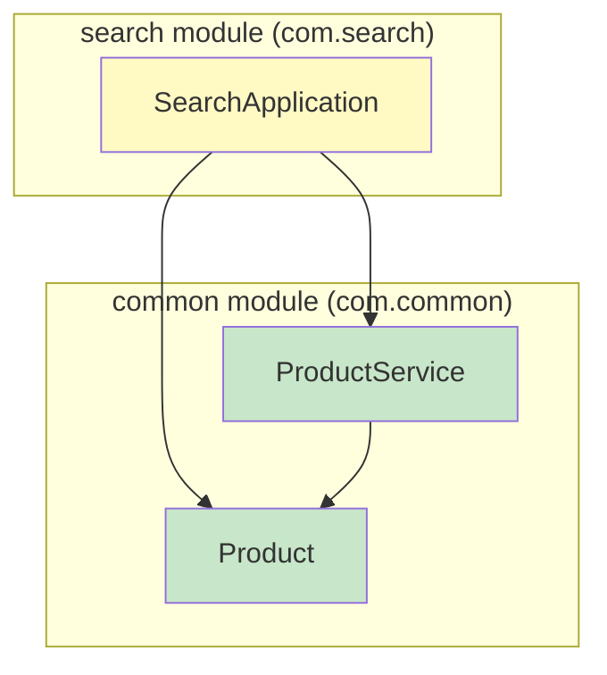

# Spring Boot Multi-Module Dependency Graph

## Quick Overview

This document provides a comprehensive view of the dependencies in this Spring Boot multi-module project.

## Module Structure

```
springboot-multi-module (root)
├── common (library module)
└── search (application module)
```

## Visual Dependency Graph

### Module Dependencies


### Complete Dependency Tree


### Class-Level Dependencies


## Detailed Module Information

### Common Module

**Purpose**: Shared library containing business entities and services

**Configuration**:
- **Artifact**: `springboot-multi-module-library-0.0.1-SNAPSHOT.jar`
- **Java Version**: 21
- **Spring Boot Version**: 2.7.18

**External Dependencies**:
```
implementation:
  └─ org.springframework.boot:spring-boot-starter:2.7.18
      ├─ spring-boot:2.7.18
      ├─ spring-boot-autoconfigure:2.7.18
      ├─ spring-boot-starter-logging
      │   ├─ logback-classic
      │   ├─ log4j-to-slf4j
      │   └─ jul-to-slf4j
      ├─ jakarta.annotation-api
      ├─ spring-core
      ├─ spring-context
      └─ snakeyaml

testImplementation:
  └─ org.springframework.boot:spring-boot-starter-test
      ├─ spring-boot-test
      ├─ spring-boot-test-autoconfigure
      ├─ junit-jupiter
      ├─ mockito-core
      ├─ assertj-core
      ├─ hamcrest
      └─ xmlunit-core
```

**Exported Classes**:
- `com.common.Product` - Entity class representing a product (id, name, price)
- `com.common.ProductService` - Service class for product CRUD operations

**Build Configuration**: `common/build.gradle`

---

### Search Module

**Purpose**: REST API application for product search and management

**Configuration**:
- **Artifact**: `springboot-multi-module-search-0.0.1-SNAPSHOT.jar`
- **Java Version**: 21
- **Spring Boot Version**: 2.7.18
- **Main Class**: `com.search.SearchApplication`
- **Server Port**: 8100

**External Dependencies**:
```
implementation:
  ├─ org.springframework.boot:spring-boot-starter-actuator
  │   ├─ spring-boot-actuator
  │   ├─ spring-boot-actuator-autoconfigure
  │   └─ micrometer-core
  │
  ├─ org.springframework.boot:spring-boot-starter-web
  │   ├─ spring-web
  │   ├─ spring-webmvc
  │   ├─ spring-boot-starter-json
  │   │   ├─ jackson-databind
  │   │   ├─ jackson-datatype-jdk8
  │   │   ├─ jackson-datatype-jsr310
  │   │   └─ jackson-module-parameter-names
  │   ├─ spring-boot-starter-tomcat
  │   │   ├─ tomcat-embed-core
  │   │   ├─ tomcat-embed-el
  │   │   └─ tomcat-embed-websocket
  │   └─ spring-web
  │
  └─ project(':common') [INTERNAL MODULE]
      └─ Provides: Product, ProductService

testImplementation:
  └─ org.springframework.boot:spring-boot-starter-test
```

**Internal Module Dependencies**:
- `:common` - Required for Product and ProductService classes

**REST Endpoints**:
- GET `/search/hello` - Test endpoint
- GET `/search/product` - Get a sample product
- GET `/search/product/{id}` - Get product by ID
- GET `/search/products` - List all products
- POST `/search/product/create` - Create a new product

**Build Configuration**: `search/build.gradle`

---

## Dependency Management

### Spring Boot Dependency Management

Both modules use Spring Boot's dependency management to ensure consistent versions:

**Common Module**:
```gradle
plugins { 
    id "io.spring.dependency-management" version "1.1.4"
}

dependencyManagement {
    imports { 
        mavenBom("org.springframework.boot:spring-boot-dependencies:${springBootVersion}") 
    }
}
```

**Search Module**:
```gradle
apply plugin: 'org.springframework.boot'
apply plugin: 'io.spring.dependency-management'
```

This approach:
- Eliminates the need to specify versions for Spring dependencies
- Ensures compatibility between all Spring Boot components
- Simplifies dependency upgrades

### Test Dependencies

Root project includes:
```gradle
testImplementation group: 'junit', name: 'junit', version: '4.12'
```

Both modules include `spring-boot-starter-test` which provides:
- JUnit 5 (Jupiter)
- Spring Test & Spring Boot Test
- Mockito
- AssertJ
- Hamcrest
- JSONassert
- JsonPath

---

## Gradle Commands

### View Dependencies

```bash
# View all dependencies for all configurations
./gradlew dependencies

# View dependencies for a specific module
./gradlew :common:dependencies
./gradlew :search:dependencies

# View only implementation dependencies
./gradlew :common:dependencies --configuration implementation
./gradlew :search:dependencies --configuration implementation

# View runtime dependencies
./gradlew :search:dependencies --configuration runtimeClasspath
```

### Generate Reports

```bash
# Print project structure
./gradlew printProjectStructure

# Generate dependency graph
./gradlew generateDependencyGraph

# Generate HTML dependency report
./gradlew htmlDependencyReport
```

### Build & Run

```bash
# Build all modules
./gradlew build

# Build specific module
./gradlew :common:build
./gradlew :search:build

# Run the search application
./gradlew :search:bootRun

# Clean and rebuild
./gradlew clean build
```

---

## Build Order

Gradle automatically determines build order based on dependencies:

1. ✓ **common** - Built first (no internal dependencies)
2. ✓ **search** - Built second (depends on common)

This ensures that when `search` is compiled, the `common` module JAR is already available.

---

## Transitive Dependencies

### Key Transitive Dependencies

Through Spring Boot starters, the project includes many transitive dependencies:

**From spring-boot-starter**:
- Spring Framework Core (spring-core, spring-context, spring-beans, spring-aop, spring-expression)
- Logging (logback-classic, slf4j-api, log4j-to-slf4j, jul-to-slf4j)
- Jakarta Annotations API
- SnakeYAML for YAML configuration

**From spring-boot-starter-web**:
- Spring MVC (spring-web, spring-webmvc)
- Embedded Tomcat Server (tomcat-embed-core, tomcat-embed-el, tomcat-embed-websocket)
- JSON Processing (Jackson: databind, core, annotations, datatype-jdk8, datatype-jsr310)

**From spring-boot-starter-actuator**:
- Spring Boot Actuator & Autoconfigure
- Micrometer Core (for metrics)

**From spring-boot-starter-test**:
- JUnit Platform & Jupiter
- Mockito Core & JUnit Jupiter
- AssertJ Core
- Hamcrest
- JSONassert
- JsonPath
- XMLUnit

---

## Version Information

| Component | Version |
|-----------|---------|
| Gradle | 8.5 |
| Java | 21 |
| Spring Boot | 2.7.18 |
| JUnit (root) | 4.12 |
| Project | 1.0-SNAPSHOT |

---

## Architecture Notes

### Module Design

1. **Separation of Concerns**: 
   - Common module contains only domain logic
   - Search module contains web/API layer

2. **Reusability**: 
   - Common module can be shared across multiple application modules
   - Clean separation allows easy testing

3. **Dependency Direction**: 
   - Flow is unidirectional: Search → Common
   - Common has no knowledge of Search

### Spring Boot Configuration

- **Component Scanning**: Search application scans `com` package to include common module components
- **Actuator**: Provides production-ready features (health checks, metrics)
- **Embedded Tomcat**: No need for external application server

---

## Future Extensions

To add new modules to this project:

1. Create new module directory
2. Add to `settings.gradle`: `include 'newmodule'`
3. Create `newmodule/build.gradle` with dependencies
4. Add dependency on common if needed: `implementation project(':common')`

Example for a new module that depends on common:
```gradle
dependencies {
    implementation project(':common')
    implementation 'org.springframework.boot:spring-boot-starter-web'
}
```
